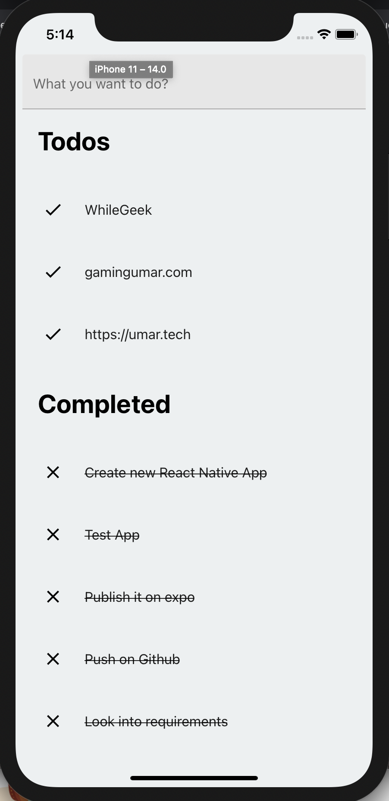

# todo-app
Just another TODO app build in React Native powered by expo.io.

### What to do?
```
npm install --global expo-cli
npm install
expo start
```

### What you can do?
- Create new TODO
- Mark as completed by tapping on todo.
- Delete TODO from Completed List.



### TODO
- Implement Async Storage
- Edit TODO
- Move item back to TODO list from Completed
- Change order of todos.